# Shape Image View [](https://travis-ci.org/siyamed/android-shape-imageview/)
Provides a set of custom shaped android imageview components, and a framework to define more shapes. Implements both **shader** and **bitmap mask** based image views. 

* Shader based one uses *canvas draw methods* and *Path* construct, 
* Mask based one uses xfermode to draw image on bitmaps defined by android shape XML's or resource bitmaps.

<div>
<a href="images/shader-buble.png" style="float:left;">

</a>
<a href="images/all-samples.png" >

</a>
</div>

There are many projects online implementing such components, however one goal of this project is to provide a performant/smooth scrolling view component framework to define different shapes for imageviews. 

**For use with recycling view such as ListView or GridView please use shader based implementations.**

## How to use

Gradle dependency:
```Groovy
compile 'com.github.siyamed:android-shape-imageview:0.9@aar'
```

####BubbleImageView
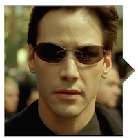
```XML
<com.github.siyamed.shapeimageview.BubbleImageView
    android:layout_width="match_parent"
    android:layout_height="match_parent"
    android:src="@drawable/neo"
    app:arrowPosition="right"
    app:square="true"/>
```

Attributes:
* `triangleHeight` the height of the bubble pointer in dp  
* `arrowPosition` where to point the arrow, currently `left|right`
* `square` set width and height to the minimum of the given values `true|false`

####RoundedImageView
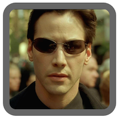
```XML
<com.github.siyamed.shapeimageview.RoundedImageView
    android:layout_width="match_parent"
    android:layout_height="match_parent"
    android:src="@drawable/neo"
    app:radius="6dp"
    app:borderWidth="6dp"
    app:borderColor="@color/darkgray"
    app:square="true"/>
```

Attributes:
* `borderColor` border color 
* `borderWidth` border width in dp
* `borderAlpha` alpha value of the border between 0.0-1.0
* `square` set width and height to the minimum of the given values `true|false`

####CircularImageView
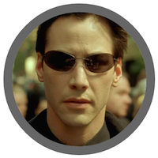
```XML
<com.github.siyamed.shapeimageview.CircularImageView
    android:layout_width="match_parent"
    android:layout_height="match_parent"
    android:src="@drawable/neo"
    app:borderWidth="6dp"
    app:borderColor="@color/darkgray"/>
```

Attributes:
* `borderColor` border color 
* `borderWidth` border width in dp
* `borderAlpha` alpha value of the border between 0.0-1.0

####DiamondImageView
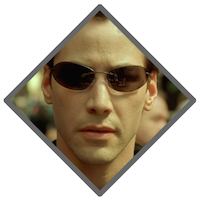
```XML
<com.github.siyamed.shapeimageview.DiamondImageView
    android:layout_width="match_parent"
    android:layout_height="match_parent"
    android:layout_margin="8dp"
    android:src="@drawable/neo"
    app:borderWidth="8dp"
    app:borderColor="@color/darkgray"/>
```

[Attributes](#shader_attributes) 

####PentagonImageView
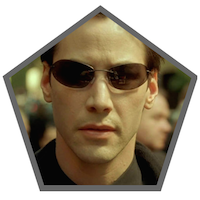
```XML
<com.github.siyamed.shapeimageview.PentagonImageView
    android:layout_width="match_parent"
    android:layout_height="match_parent"
    android:layout_margin="8dp"
    android:src="@drawable/neo"
    app:borderWidth="8dp"
    app:borderColor="@color/darkgray"/>
```

[Attributes](#shader_attributes) 

####HexagonImageView
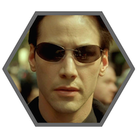
```XML
<com.github.siyamed.shapeimageview.HexagonImageView
    android:layout_width="match_parent"
    android:layout_height="match_parent"
    android:layout_margin="8dp"
    android:src="@drawable/neo"
    app:borderWidth="8dp"
    app:borderColor="@color/darkgray"/>
```

[Attributes](#shader_attributes) 

####OctogonImageView
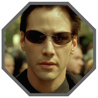
```XML
<com.github.siyamed.shapeimageview.Octogon
    android:layout_width="match_parent"
    android:layout_height="match_parent"
    android:layout_margin="8dp"
    android:src="@drawable/neo"
    app:borderWidth="8dp"
    app:borderColor="@color/darkgray"/>
```

[Attributes](#shader_attributes) 

####StarImageView
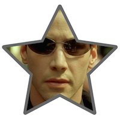
```XML
<com.github.siyamed.shapeimageview.StarImageView
    android:layout_width="match_parent"
    android:layout_height="match_parent"
    android:layout_margin="8dp"
    android:src="@drawable/neo"
    app:borderWidth="8dp"
    app:borderColor="@color/darkgray"
    app:strokeCap="round"
    app:strokeJoin="round"/>
```

[Attributes](#shader_attributes) 

####HeartImageView
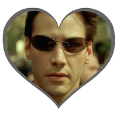
```XML
<com.github.siyamed.shapeimageview.Heart
    android:layout_width="match_parent"
    android:layout_height="match_parent"
    android:layout_margin="8dp"
    android:src="@drawable/neo"
    app:borderWidth="8dp"
    app:borderColor="@color/darkgray"/>
```

[Attributes](#shader_attributes) 

<a name="shader_attributes"></a>
Attributes:
* `borderColor` border color 
* `borderWidth` border width in dp
* `borderAlpha` alpha value of the border between 0.0-1.0
* `strokeCap` border stroke cap type `butt|round|square`
* `strokeJoin` border stroke join type `bevel|miter|round`

####PorterShapeImageView

This methods uses extra bitmaps for masks. Therefore it would be good to use them for very custom shapes, possiblynot in a recycling view. 

* With [mask bitmap](sample/src/main/res/drawable/star.png): 

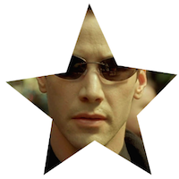
```XML
<com.github.siyamed.shapeimageview.shape.PorterShapeImageView
    android:layout_width="match_parent"
    android:layout_height="match_parent"
    app:shape="@drawable/star"
    android:src="@drawable/neo"
    app:square="true"/>
```

* With [shape XML](sample/src/main/res/drawable/shape_rounded_rectangle.xml):

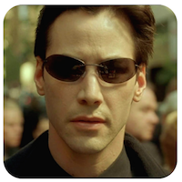

```XML
<com.github.siyamed.shapeimageview.shape.PorterShapeImageView
    android:layout_width="match_parent"
    android:layout_height="match_parent"
    app:shape="@drawable/shape_rounded_rectangle"
    android:src="@drawable/neo"
    app:square="true"/>
```

rounded rectangle shape definition in XML: 

```XML
<shape android:shape="rectangle" xmlns:android="http://schemas.android.com/apk/res/android">
    <corners
        android:topLeftRadius="18dp"
        android:topRightRadius="18dp"
        android:bottomLeftRadius="18dp"
        android:bottomRightRadius="18dp" />
    <solid android:color="@color/black" />
</shape>
```

Attributes:
* `shape` the bitmap mask shape, either a shape drawable or a bitmap  
* `square` set width and height to the minimum of the given values `true|false`

## Sample

See/execute the [sample](sample) for a demonstration of the components.

If you are lazy check [this youtube video](http://youtu.be/6fCkptmwxtQ) demonstrating scrolling in the sample app

## References
* [MostafaGazar/CustomShapeImageView](https://github.com/MostafaGazar/CustomShapeImageView): Used this project a basis for bitmap masks  
* [geosolutions-it/mapsforge/svg-android](https://github.com/geosolutions-it/mapsforge/tree/master/svg-android): Used and modified to create a path from a svg file 

[](https://android-arsenal.com/details/1/932)
